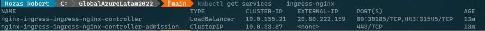
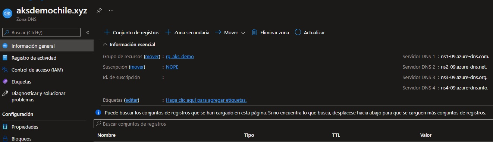
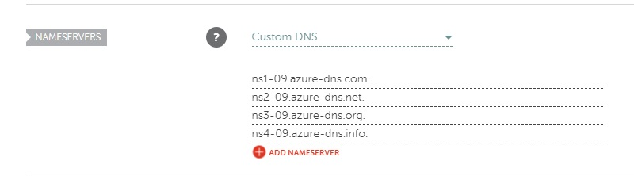

# GlobalAzureLatam2022


# Create an HTTPS ingress controller on Azure Kubernetes Service (AKS)

An ingress controller is a piece of software that provides reverse proxy, configurable traffic routing, and TLS termination for Kubernetes services. Kubernetes ingress resources are used to configure the ingress rules and routes for individual Kubernetes services. Using an ingress controller and ingress rules, a single IP address can be used to route traffic to multiple services in a Kubernetes cluster.

This article shows you how to deploy the [NGINX ingress controller][nginx-ingress] in an Azure Kubernetes Service (AKS) cluster. 
## Before you begin

This article assumes that you have an existing AKS cluster. If you need an AKS cluster, see the AKS quickstart [using the Azure CLI][aks-quickstart-cli] or [using the Azure portal][aks-quickstart-portal].

This article also assumes you have [a custom domain][custom-domain] with a [DNS Zone][dns-zone] in the same resource group as your AKS cluster.

This article uses [Helm 3][helm] to install the NGINX ingress controller and cert-manager. Make sure that you are using the latest release of Helm and have access to the *ingress-nginx* and *jetstack* Helm repositories. For upgrade instructions, see the [Helm install docs][helm-install]. For more information on configuring and using Helm, see [Install applications with Helm in Azure Kubernetes Service (AKS)][use-helm].

This article also requires that you are running the Azure CLI version 2.0.64 or later. Run `az --version` to find the version. If you need to install or upgrade, see [Install Azure CLI][azure-cli-install].

## Create an ingress controller

To create the ingress controller, use the `helm` command to install *nginx-ingress*. For added redundancy, two replicas of the NGINX ingress controllers are deployed with the `--set controller.replicaCount` parameter. To fully benefit from running replicas of the ingress controller, make sure there's more than one node in your AKS cluster.

The ingress controller also needs to be scheduled on a Linux node. Windows Server nodes shouldn't run the ingress controller. A node selector is specified using the `--set nodeSelector` parameter to tell the Kubernetes scheduler to run the NGINX ingress controller on a Linux-based node.

> [!TIP]
> The following example creates a Kubernetes namespace for the ingress resources named *ingress-nginx*. Specify a namespace for your own environment as needed.

> [!TIP]
> If you would like to enable [client source IP preservation][client-source-ip] for requests to containers in your cluster, add `--set controller.service.externalTrafficPolicy=Local` to the Helm install command. The client source IP is stored in the request header under *X-Forwarded-For*. When using an ingress controller with client source IP preservation enabled, TLS pass-through will not work.

```console
# Create a namespace for your ingress resources
kubectl create namespace ingress-nginx

# Add the ingress-nginx repository
helm repo add ingress-nginx https://kubernetes.github.io/ingress-nginx

# Use Helm to deploy an NGINX ingress controller
helm install nginx-ingress ingress-nginx/ingress-nginx \
    --namespace ingress-nginx \
    --set controller.replicaCount=2 \
    --set controller.nodeSelector."beta\.kubernetes\.io/os"=linux \
    --set defaultBackend.nodeSelector."beta\.kubernetes\.io/os"=linux
```

During the installation, an Azure public IP address is created for the ingress controller. This public IP address is static for the life-span of the ingress controller. If you delete the ingress controller, the public IP address assignment is lost. If you then create an additional ingress controller, a new public IP address is assigned. If you wish to retain the use of the public IP address, you can instead [create an ingress controller with a static public IP address][aks-ingress-static-tls].

To get the public IP address, use the `kubectl get service` command. It takes a few minutes for the IP address to be assigned to the service.

```
$ kubectl --namespace ingress-nginx get services -o wide -w nginx-ingress-ingress-nginx-controller

NAME                                     TYPE           CLUSTER-IP    EXTERNAL-IP     PORT(S)                      AGE   SELECTOR
nginx-ingress-ingress-nginx-controller   LoadBalancer   10.0.74.133   EXTERNAL_IP     80:32486/TCP,443:30953/TCP   44s   app.kubernetes.io/component=controller,app.kubernetes.io/instance=nginx-ingress,app.kubernetes.io/name=ingress-nginx
```

No ingress rules have been created yet. If you browse to the public IP address, the NGINX ingress controller's default 404 page is displayed.

## Add DNS Zone and an A record to your DNS zone

You are going to need a real domain, like `MY_CUSTOM_DOMAIN=aksdemochile.xyz`

Create a DNS zone, with the same name as your custom domain

```console
az network dns zone create -g myResourceGroup -n MY_CUSTOM_DOMAIN
```

Add an *A* record to your DNS zone with the external IP address of the NGINX service using [az network dns record-set a add-record][az-network-dns-record-set-a-add-record].

```console
az network dns record-set a add-record \
    --resource-group myResourceGroup \
    --zone-name MY_CUSTOM_DOMAIN \
    --record-set-name * \
    --ipv4-address MY_EXTERNAL_IP
```

In order to get the value for `MY_EXTERNAL_IP`, you need to get the `external ip` of your `ingress-nginx-controller` load balancer service.



Based on that command output, the value for `MY_EXTERNAL_IP` should be `52.138.109.161`

## Domain name servers configuration

In the azure portal, you need to check de `name servers` for the dns zone created previously.



You are going to get and output, something similar to this one:
```
Name server 1: ns1-07.azure-dns.com.
Name server 2:ns2-07.azure-dns.net.
Name server 3:ns3-07.azure-dns.org.
Name server 4:ns4-07.azure-dns.info.
```

Then in the admin pannel of your real domain `bennu.info`, you need to point the DNS servers, to the name servers of your dns zone, like:



> [!NOTE]
> Optionally, you can configure an FQDN for the ingress controller IP address instead of a custom domain. Note that this sample is for a Bash shell.
> 
> ```azurecli-interactive
> # Public IP address of your ingress controller
> IP="MY_EXTERNAL_IP"
> 
> # Name to associate with public IP address
> DNSNAME="demo-aks-ingress"
> 
> # Get the resource-id of the public ip
> PUBLICIPID=$(az network public-ip list --query "[?ipAddress!=null]|[?contains(ipAddress, '$IP')].[id]" --output tsv)
> 
> # Update public ip address with DNS name
> az network public-ip update --ids $PUBLICIPID --dns-name $DNSNAME
> 
> # Display the FQDN
> az network public-ip show --ids $PUBLICIPID --query "[dnsSettings.fqdn]" --output tsv
> ```